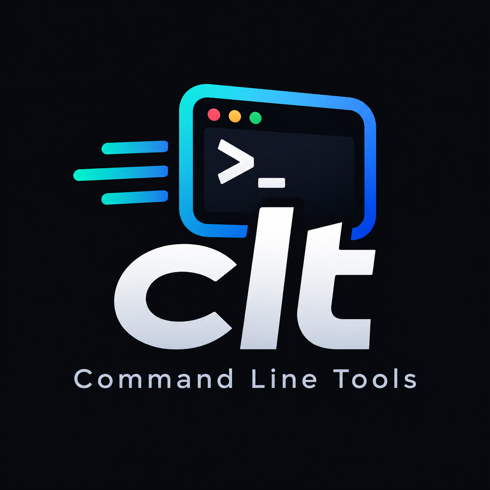

<p align="center">
  
</p>

> A personal collection of terminal-based tools built in Python — each one solving a specific everyday task directly from the command line, with no GUI required.

---

## 🛠 Tools

### 🎵 spoty — Spotify CLI Player
> `clt/spotify/`

Interact with your Spotify account entirely from the terminal. Fetches your most played tracks, searches by partial song or artist name, and plays full tracks locally via `spotifyd` (Spotify Premium required). Features a live progress bar, shuffle mode, artist filtering, and automatic queue continuation after your playlist ends.

```bash
python3 spoty.py                                  # your top 10 tracks
python3 spoty.py "audioslave" --play              # search + play
python3 spoty.py --range long_term --shuffle --play  # all-time, shuffled
python3 spoty.py --artist "garbage" --play        # filter top tracks by artist
```

---

### 🌐 deepl — DeepL CLI Translator
> `clt/deepl/`

Translate text from the terminal using the DeepL API. Minimal setup — just add your API key to a `.env` file and translate any text to any supported language without leaving your shell.

```bash
python3 translate.py "Hola mundo" --target EN
python3 translate.py "Hello world" --target ES
```

---

### ⚽ espn-results-cli — ESPN Soccer Results
> `clt/espn-results-cli/`

Scrapes ESPN Uruguay for soccer match results on any given date. Supports filtering by league name and displays kickoff times, venues, cities and countries. No API key needed.

```bash
python3 espn_results.py                          # today's results
python3 espn_results.py 20260916                 # specific date
python3 espn_results.py 20260916 -l "Champions"  # filter by league
```

---

## 📋 Requirements

Each tool has its own `requirements.txt`. Install per tool:

```bash
pip install -r clt/<tool>/requirements.txt
```

## 🐍 Python

All tools require Python 3.8+.
